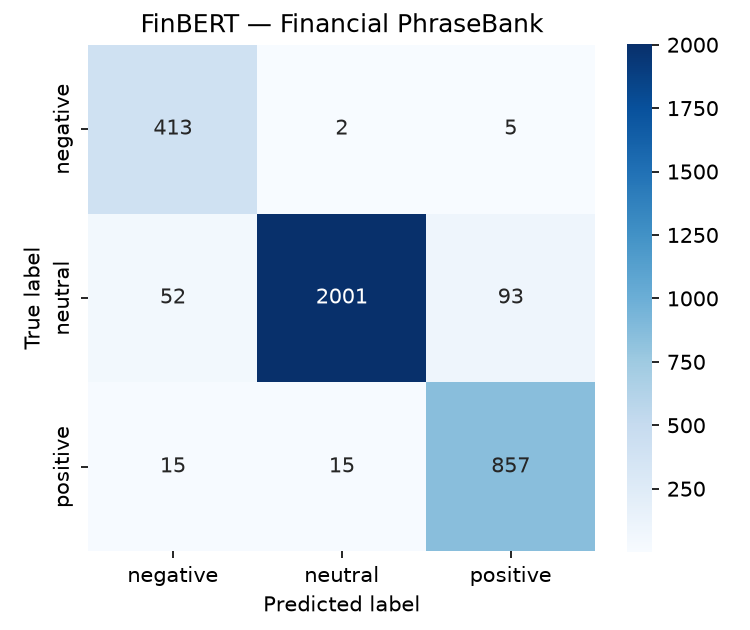
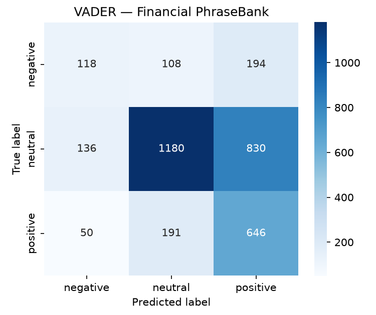

# FinBERT evaluation — Financial PhraseBank

A reproducible benchmark of the same FinBERT model the application runs (`src.tools.sentiment_model.FinBERTSentiment`) against the Financial PhraseBank dataset, with a VADER rule-based baseline for context. The goal is rigor over demo: a measured, honest picture of where the model earns its keep and where it breaks.

**Dataset:** `financial_phrasebank` / `sentences_75agree` — 3453 sentences.

**Label distribution:** negative: 420 (12.2%), neutral: 2146 (62.1%), positive: 887 (25.7%).

## Metrics

| Model | Accuracy | Macro-F1 | Neg P/R | Neu P/R | Pos P/R |
|---|---|---|---|---|---|
| FinBERT | 0.947 | 0.936 | 0.86/0.98 | 0.99/0.93 | 0.90/0.97 |
| VADER | 0.563 | 0.494 | 0.39/0.28 | 0.80/0.55 | 0.39/0.73 |

## Confusion matrices

Rows are the true label, columns the predicted label (order: negative, neutral, positive).

### FinBERT

### VADER

## Error analysis

FinBERT misclassified 182 of 3453 sentences (accuracy 94.7%, macro-F1 93.6%). VADER reached 56.3% accuracy / 49.4% macro-F1.

The single largest error class is **neutral → positive** (93 cases), i.e. true `neutral` sentences predicted as `positive`.

Per-class recall:

- `negative`: 98.3% (420 examples)
- `neutral`: 93.2% (2146 examples)
- `positive`: 96.6% (887 examples)

### Sample misclassifications

Up to 40 FinBERT errors, sorted by how confidently wrong the model was (highest margin between the predicted class and the runner-up first). Buckets are *approximate* keyword heuristics, not ground truth.

| True → Pred | Conf. | Bucket | Sentence |
|---|---|---|---|
| neutral → negative | 0.97 | mixed-signal (both positive and negative cues) | In Sweden , Gallerix accumulated SEK denominated sales were down 1 % and EUR denominated sales were up 11 % . |
| positive → negative | 0.97 | domain vocabulary (financial event verbs) | Operating loss was EUR 179mn , compared to a loss of EUR 188mn in the second quarter of 2009 . |
| positive → negative | 0.97 | domain vocabulary (financial event verbs) | Unit costs for flight operations fell by 6.4 percent . |
| neutral → negative | 0.97 | domain vocabulary (financial event verbs) | Among other industrial stocks , Metso added 0.53 pct to 40.04 eur , Wartsila B was down 0.77 pct at 47.87 eur and Rautaruukki K was 1.08 ... |
| neutral → negative | 0.97 | domain vocabulary (financial event verbs) | Operating loss landed at EUR39m including one-offs and at EUR27m excluding one-offs . |
| neutral → negative | 0.96 | mixed-signal (both positive and negative cues) | Sales in local currencies decreased by 0.5 percent while the number of subscribers rose by 12.7 million to a total of 147.6 million at th... |
| neutral → negative | 0.96 | other / subtle phrasing | When cruising , the revs fall as less engine output is required . |
| neutral → negative | 0.96 | mixed-signal (both positive and negative cues) | Finnish fibers and plastics producer Suominen Corporation OMX Helsinki : SUY1V reported on Wednesday 22 October an operating loss of EUR0... |
| neutral → negative | 0.96 | mixed-signal (both positive and negative cues) | The company reported a profit of 800,000 euro ($ 1.2 mln)on the sale of its Varesvuo Partners sub-group and a loss of 400,000 euro $ 623,... |
| neutral → negative | 0.95 | mixed-signal (both positive and negative cues) | Loudeye Corp. , up $ 2.56 at $ 4.33 Nokia Corp. , down 10 cents at $ 19.46 Nokia agreed to buy the digital music distributor for $ 60 mil... |
| positive → negative | 0.96 | domain vocabulary (financial event verbs) | The company reports a loss for the period of EUR 0.4 mn compared to a loss of EUR 1.9 mn in the corresponding period in 2005 . |
| neutral → negative | 0.95 | domain vocabulary (financial event verbs) | Previously , it projected the figure to be slightly lower than in 2009 . |
| neutral → negative | 0.95 | other / subtle phrasing | The adjustments concern staff in both the Specialty Papers and the Fiber Composites segments . |
| neutral → negative | 0.95 | mixed-signal (both positive and negative cues) | In Asia earlier , Japan 's Nikkei index fell 0.62 percent and Hong Kong 's Hang Seng Index rose 0.56 percent . |
| neutral → negative | 0.95 | mixed-signal (both positive and negative cues) | Sales fell abroad but increased in Finland . |
| neutral → negative | 0.94 | mixed-signal (both positive and negative cues) | The broad-based WIG index ended Thursday 's session 0.1 pct up at 65,003.34 pts , while the blue-chip WIG20 was 1.13 down at 3,687.15 pts . |
| negative → positive | 0.94 | domain vocabulary (financial event verbs) | 11 August 2010 - Finnish measuring equipment maker Vaisala Oyj HEL : VAIAS said today that its net loss widened to EUR4 .8 m in the first... |
| neutral → negative | 0.94 | other / subtle phrasing | High winds also toppled three semi-trailers on I-15 north of Barstow . |
| neutral → negative | 0.94 | other / subtle phrasing | The measures taken will cause one-time costs during the final part of 2006 . |
| neutral → negative | 0.94 | other / subtle phrasing | The board further said the company omitted to tender for a substantial part of the works and as such they had rightfully been found non-r... |
| neutral → negative | 0.94 | other / subtle phrasing | The difference can be explained by the fact that two shipping companies have stopped operating in the Gulf of Finland . |
| negative → positive | 0.93 | domain vocabulary (financial event verbs) | ADP News - Apr 22 , 2009 - Finnish business information systems developer Solteq Oyj HEL : STQ1V said today its net loss widened to EUR 1... |
| negative → positive | 0.93 | domain vocabulary (financial event verbs) | Finnish power supply solutions and systems provider Efore Oyj said its net loss widened to 3.2 mln euro $ 4.2 mln for the first quarter o... |
| positive → negative | 0.93 | domain vocabulary (financial event verbs) | The loss for the third quarter of 2007 was EUR 0.3 mn smaller than the loss of the second quarter of 2007 . |
| neutral → negative | 0.93 | other / subtle phrasing | The company is now withdrawing the second part , EUR 7.2 mn , of the investment commitment . |
| neutral → positive | 0.93 | other / subtle phrasing | The company said that it has agreed to a EUR160m unsecured credit line from lenders . |
| neutral → positive | 0.93 | other / subtle phrasing | Finnish property investor Sponda said it has agreed a 100 mln eur , five-year mln credit facility with Swedbank and a 50 mln eur , seven-... |
| neutral → positive | 0.93 | mixed-signal (both positive and negative cues) | On the route between Helsinki in Finland and Tallinn in Estonia , cargo volumes increased by 36 % , while cargo volumes between Finland a... |
| neutral → positive | 0.93 | other / subtle phrasing | Karppinen expects the consolidation trend to continue in the Finnish market . |
| neutral → positive | 0.92 | other / subtle phrasing | 3 January 2011 - Scandinavian lenders Sampo Bank ( HEL : SAMAS ) , Pohjola Bank ( HEL : POH1S ) and Svenska Handelsbanken ( STO : SHB A )... |
| neutral → positive | 0.92 | other / subtle phrasing | The mill 's raw material need will increase by 100,000 m3 of wood . |
| neutral → positive | 0.92 | other / subtle phrasing | The shipyard hopes the regional government in Andalusia can offer its some form of financial support . |
| positive → negative | 0.91 | other / subtle phrasing | Return on investment was 16.6 % compared to 15.8 % in 2004 . |
| neutral → positive | 0.91 | other / subtle phrasing | `` Management decided at the end of 2005 to increase cathode copper capacity . |
| positive → neutral | 0.90 | other / subtle phrasing | Employees are also better prepared to answer calls , since they already have detailed information about the caller before they answer the... |
| neutral → positive | 0.89 | other / subtle phrasing | Amer , which bought Salomon from adidas in October , said the job cuts are aimed at boosting competitiveness . |
| neutral → positive | 0.90 | other / subtle phrasing | It 's even a little bit higher than Yara 's multiples on itself , ' an analyst in Helsinki said . |
| neutral → positive | 0.90 | other / subtle phrasing | The insurance division turned a EUR120m profit . |
| neutral → positive | 0.87 | negation / contrast (failed to, despite, however, ...) | In Finland , the launch of tie-in sales of 3G mobile phones did not cause a dramatic rush in mobile retail outlets during the first few d... |
| neutral → positive | 0.89 | other / subtle phrasing | Following the issue , the number of shares in the Swedish company will grow by 9 % . |

### Full error dump
Every misclassification (text, true label, predicted label, class probabilities) is in `finbert_errors.json` for deeper inspection.

